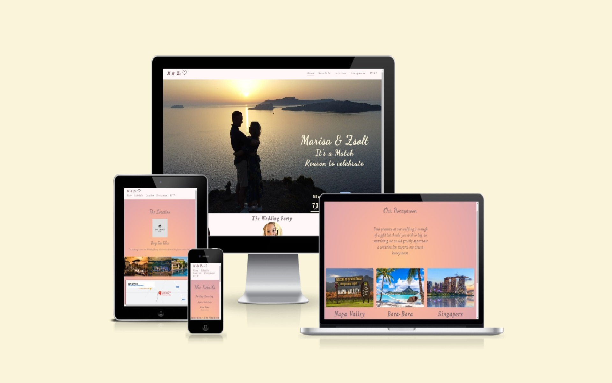
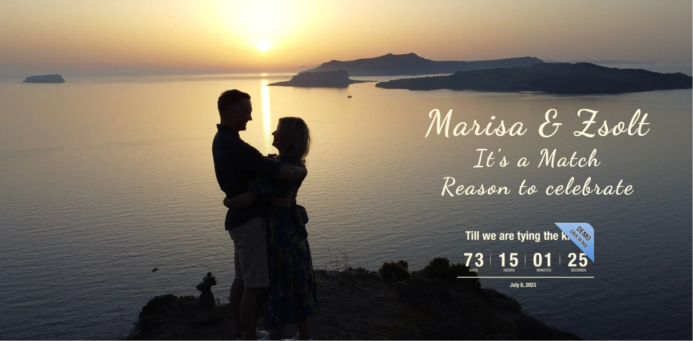
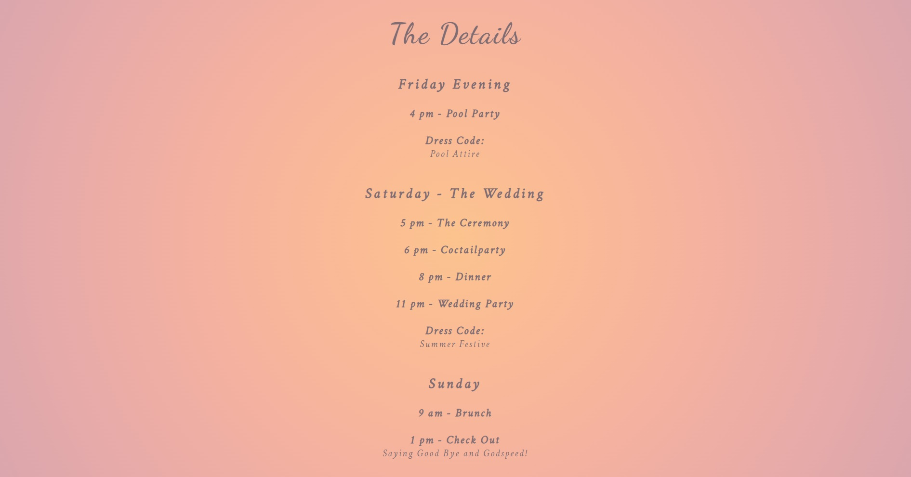
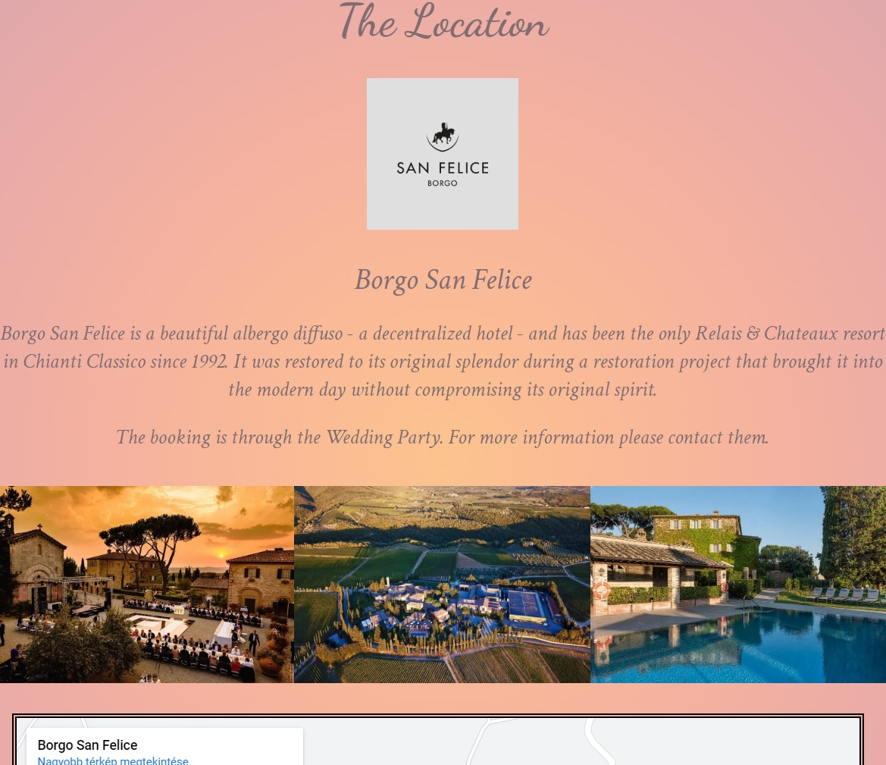
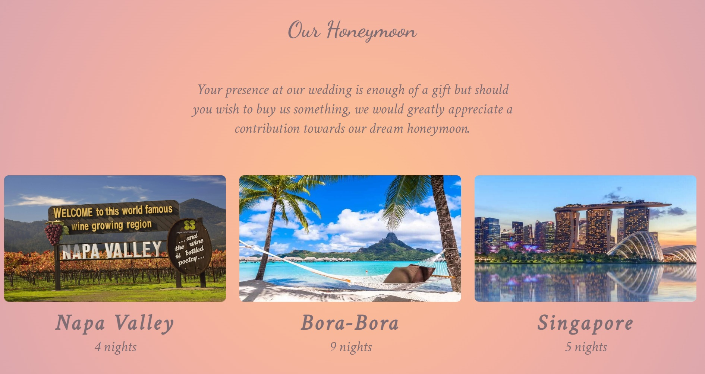
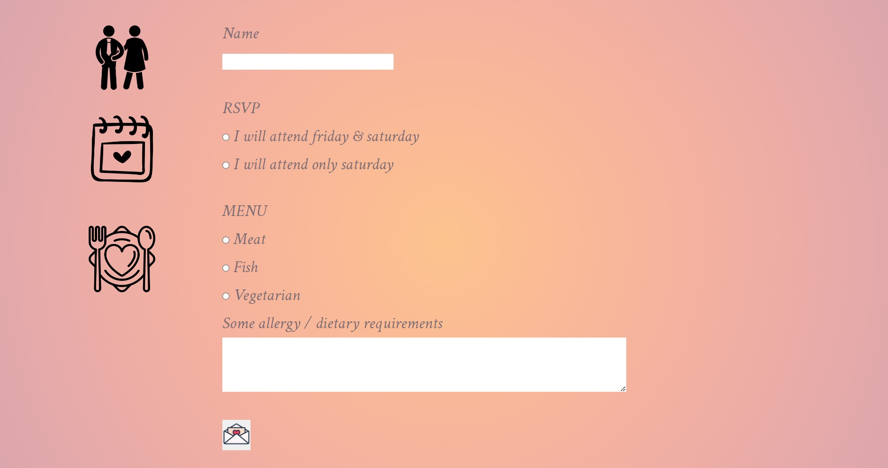

# Marisa & Zsolt wedding website
## [my-first-project](https://empzsolt.github.io/my-first-project/)

This website was created for the wedding of Marisa and Zsolt. The main purpose is to let their family, friends and the world know that they are getting married. In addition it serves as a source of other related information, such as a detailed program, the wedding venue, the planned honeymoon and the application (rsvp) for the wedding.

## Features
- Logo and Navigation Bar
     * Featured on all 5 pages, the full responsive navigation bar includes links to the Logo with an animated icon, Home page, Schedule page, Location page, Honeymoon page and Rsvp application page and is identical in each page to allow for easy navigation.
     * This section will allow the user to easly navigate from page to page across all devices without having to revert back to the pervious page via the 'back' button.
     * For transparent and easy selection, the navigation links are underlined and highlighted with color.

     

- The Hero image
     * The hero image contains a photo with a text overlay and a countdown clock that highlights Marisa and Zsolt's love.
     * This part attracts the user's attention with a zoom in animation and puts the couple in the center.
     * The countdown clock specifically draws attention to the proximity of the event.

     

- The Footer
     * In the footer section located the contacts, so the members of the wedding party.
     * Introducing the members with a separate photo and their contact information.

     

- Schedule page
     * The schedule section is designed to inform the user about the detailed wedding program.
     * It also informs the dress code.

     

- Location page
     * The location section presents the hotel where the wedding will take place.
     * In addition to the location logo, three on-site photos, and Google Maps location, there is also a link embedded in the name of the hotel, which leads to their official website, informing the visitor.

     

- Honeymoon page
     * The honeymoon page simply and concisely describes the locations, complete with pictures and duration.
     * It also contains a text message which purpose is to thank the guests for their presence and hint at the possibility of contributing.

     

- RSVP Application
     * This page allows the user to register for the wedding. The user must enter his/her name, which day he/she wishes to participate, and what menu he/she would like to eat.
     * Different icons help to separate the different question sections for easier overview.
     * He/she can only apply after you have entered all the required information. The submit button is represented by a love letter image.

     

## Testing

- I tested that this page works in different browsers: Microsoft Edge, Google Chrome, Firefox.
- I confirmed that this project is responsive, functions on all standard screen sizes using the devtools device toolbar.
- I confirmed that the navigation, header, cover text, contacts, schedule, location, honeymoon and the rsvp are all readable and easy to understand.
- I have confirmed that the form works: requires entires in every field and the submit button works.

### Bugs

- When I first time used the font awesome icons and they didn't show up. I later realized that these were not free icons, so I replaced as many as I could find to be reasonably similar. This happend with the main logo in the header. The rest I replaced with similar images. This was the solution is the rsvp page, where the images reprezenting the different section of the qestions.

- When I used the iframe element for showing the hotel location it showed a broken sign and said the google rejecting the connection. It turned out that I copied the google search url as the source and not the correct google map source.

- The first time I tried responsive design, it became apparent that the footer contact people could not stay together at a smaller aspect ratio and broke the balance, and the images didn't keep their proportions either. First of all, at a smaller aspect ratio, I introduced two lines, those avoiding fragmentation and overcrowding, and used 'object-fit: cover;' style declaration to keep the aspect ratio on the pictures. 

- On the honeymoon page, the pictures of the locations also caused problems at smaller screen sizes. After a while, they ran into each other or the ratios simply weren't good. So I decided to switch from the horizontal to the vertical positioning at a smaller screen size. I achieved this by changing the value of display to block.

- There were also problems with keeping the images in position on the display of smaller devices on the rsvp page. I was able to compensate for this by adding additional sytle declarations, such as height and margin changes.